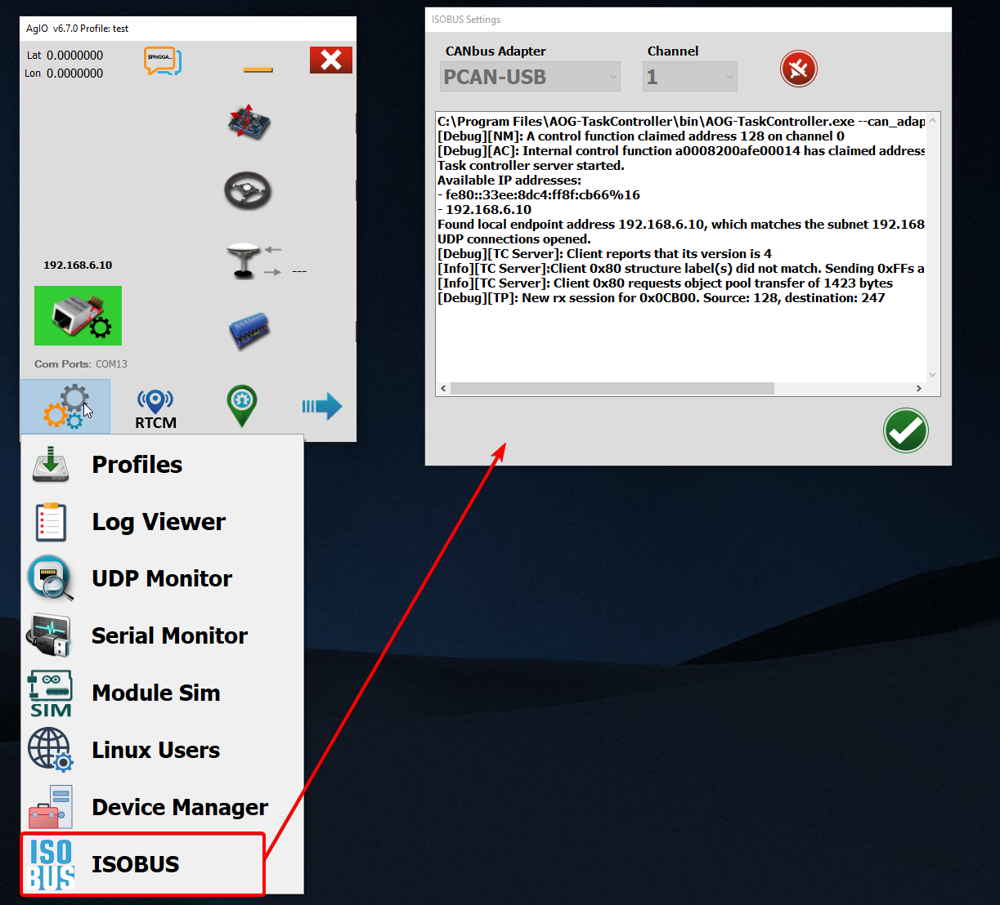

# AOG-TaskController 🚜

This is an experimental project to control sections of an ISOBUS implement using AgOpenGPS. It is based on the [AgIsoStack++](https://github.com/Open-Agriculture/AgIsoStack-plus-plus) library.

## How to run the project

After installing the desired release of AOG-TaskController, you can run it directly through AgOpenGPS itself:

1. Open AgIO.
2. Go to the `Settings` tab.
3. Click on the `ISOBUS` tab.
4. Select the CAN adapter and channel you want to use.
5. Click on the `connect` button.



## How to package the project

To package the project, you need to have the following tools installed:

- [CMake](https://cmake.org/download/)
- [C++ build tools](https://visualstudio.microsoft.com/visual-cpp-build-tools/)

Then, you can run the following commands:

```bash
mkdir build
cmake -S . -B build -DBUILD_EXAMPLES=OFF -DBUILD_TESTING=OFF -Wno-dev
cmake --build build --config Release --target package
```

The installer will be generated in the `build` directory.
